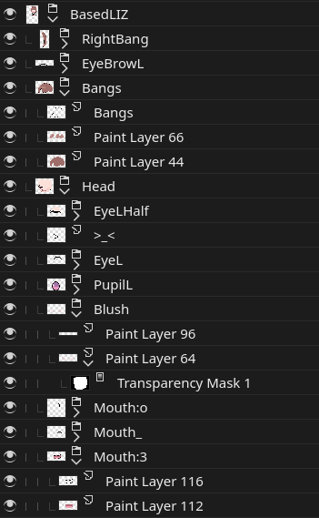
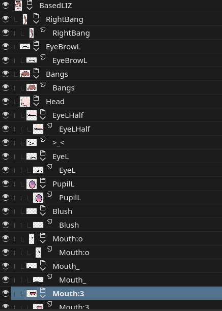

# Live2D Prep plugin

Krita plugin that prepares a document for use in Live2D.

It does the following:
* Merges all layers that consist of only paint layers whilst maintaining group heirarchy
* Saves every visible top-level node into a psd file of the same name

A project with the following layer heirarchy where lineart and fill colors are
separate layers:

This plugin will produce the following:

The grouping is useful for defining "Parts" in Live2D.

## Usage
Navigate to `Tools > Scripts > Live2D Export`.

## Installation
See the
[Krita documentation](https://docs.krita.org/en/user_manual/python_scripting/install_custom_python_plugin.html)
on how to install Krita plugins.
